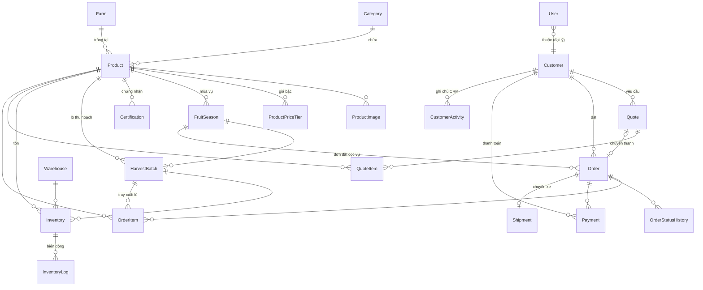

# 03 — Thiết kế cơ sở dữ liệu

> Schema thực thi nằm tại [`apps/api/prisma/schema.prisma`](../apps/api/prisma/schema.prisma) — đây là nguồn sự thật duy nhất. Tài liệu này giải thích cấu trúc và các quyết định thiết kế.

## 1. Sơ đồ quan hệ (rút gọn theo nhóm)

Nhóm nội dung (CMS) độc lập: `Post`, `Banner`, `Video`, `GalleryImage`, `Review`, `Faq`, `Setting`, `Contact`, `Coupon`, `Notification`, `ActivityLog`.

## 2. Danh sách bảng (≈ 30 bảng)

### Nhóm người dùng & khách hàng

| Bảng | Vai trò | Cột đáng chú ý |
|---|---|---|
| `users` | Tài khoản đăng nhập (đại lý/nhân viên/admin) | `role`, `status`, `customerId`, `refreshTokenHash`, `twoFactorSecret` |
| `customers` | Hồ sơ doanh nghiệp khách (kể cả chưa có tài khoản) | `customerType` (7 nhóm), `taxCode` (MST), `creditLimit`, `currentDebt`, `paymentTermDays`, `discountRate` |
| `customer_activities` | CRM: ghi chú giao dịch, cuộc gọi, chính sách riêng | `type`, `content`, `staffId` |

**Quyết định**: tách `users` (đăng nhập) khỏi `customers` (pháp nhân mua hàng) vì: (1) thương lái có thể là khách quen nhưng không bao giờ tạo tài khoản — nhân viên vẫn cần lưu hồ sơ + công nợ; (2) một công ty có thể có nhiều tài khoản đăng nhập.

### Nhóm sản phẩm

| Bảng | Vai trò | Cột đáng chú ý |
|---|---|---|
| `categories` | Danh mục (Xoài, Nhãn, Mận…) | `slug`, `parentId` (2 cấp), SEO |
| `products` | Sản phẩm | `slug`, `unit`, `retailPrice?`, `wholesalePrice?`, `dealerPrice?`, **`isPriceVisible`**, `minOrderQuantity`, `isFeatured`, `isExportQuality`, `origin`, `growingRegion`, `harvestPeriod`, `status (ACTIVE/HIDDEN/OUT_OF_SEASON)`, SEO |
| `product_images` | Ảnh + video (theo `type`) | `url`, `sortOrder` |
| `product_price_tiers` | **Giá bậc thang theo số lượng** | `minQuantity`, `price`, `label` ("Từ 100kg") |
| `fruit_seasons` | **Mùa vụ**: lịch thu hoạch + sản lượng | `year`, `startMonth`, `endMonth`, `estimatedYieldKg`, `actualYieldKg`, `status (UPCOMING/HARVESTING/ENDED)` |
| `farms` | Vùng trồng/nhà vườn | `region`, `areaHectares`, ảnh |
| `certifications` | VietGAP/GlobalGAP/Organic (file PDF/ảnh) | `type`, `fileUrl`, `expiresAt`, gắn `productId` hoặc `farmId` |

**Quyết định về giá** — 3 lớp phối hợp:
1. `products.retailPrice / wholesalePrice / dealerPrice`: giá nền tham khảo (đúng spec mục 6).
2. `product_price_tiers`: bảng bậc 10kg/50kg/100kg/500kg/1 tấn — quyết định đơn giá thực tế theo khối lượng.
3. `customers.discountRate`: chiết khấu riêng từng khách áp lên giá bậc.
Giá "theo mùa" = admin cập nhật bảng giá khi vào vụ (kèm `ActivityLog`); lịch sử giá xem qua log.

### Nhóm kho & lô hàng

| Bảng | Vai trò | Cột đáng chú ý |
|---|---|---|
| `warehouses` | Kho/điểm tập kết | `name`, `address`, `capacityKg` |
| `harvest_batches` | **Lô thu hoạch** — truy xuất nguồn gốc | `code` (VD `XYC-20260612-01`), `harvestDate`, `quantityKg`, `remainingKg`, `qualityGrade (A/B/C)`, `status` |
| `inventories` | Tồn theo (kho × sản phẩm × lô) | `quantity`, `reservedQuantity` (đơn đã xác nhận giữ chỗ) |
| `inventory_logs` | Mọi biến động kho (bất biến, chỉ ghi thêm) | `type (HARVEST_IN/SALE_OUT/DAMAGE/ADJUSTMENT/RETURN_IN)`, `quantity`, `orderId?`, `createdById` |

**Tồn khả dụng** = `quantity − reservedQuantity`. Trạng thái spec yêu cầu ánh xạ: *Đã thu hoạch* = tổng `HARVEST_IN`; *Đang thu hoạch* = `fruit_seasons.status=HARVESTING` + `harvest_batches.status=HARVESTING`; *Đã bán* = tổng `SALE_OUT`; *Tồn* = `inventories`; *Sắp hết* = tồn khả dụng < ngưỡng `lowStockThreshold` của sản phẩm.

### Nhóm báo giá & đơn hàng

| Bảng | Vai trò | Cột đáng chú ý |
|---|---|---|
| `quotes` | Yêu cầu báo giá (khách vãng lai hoặc đại lý) | `code (BG-2026-00001)`, liên hệ (họ tên/công ty/SĐT/email), `status`, `validUntil`, `pdfUrl`, `assignedToId` |
| `quote_items` | Dòng yêu cầu | `quantity`, `unit`, `quotedPrice` (nhân viên điền) |
| `orders` | Đơn hàng | `code (DH-2026-00001)`, `type (STANDARD/PRE_ORDER)`, `seasonId?` (đặt cọc vụ), `status` (8 trạng thái), `deliveryDate/Address/Province`, `subtotal`, `discountAmount`, `shippingFee`, `totalAmount`, `depositAmount`, `paidAmount`, `paymentStatus (UNPAID/DEPOSIT/PARTIAL/PAID)`, `dueDate` (hạn công nợ) |
| `order_items` | Dòng đơn | `quantity`, `unitPrice`, `subtotal`, `batchId?` (lô xuất) |
| `order_status_history` | Lịch sử chuyển trạng thái | `fromStatus`, `toStatus`, `changedById`, `note` |
| `payments` | Phiếu thu | `method (COD/BANK_TRANSFER/VNPAY/MOMO/ZALOPAY)`, `type (DEPOSIT/PARTIAL/FULL/DEBT_PAYMENT)`, `status`, `transactionRef` |
| `shipments` | Chuyến giao | `method (OWN_TRUCK/CONTAINER/THIRD_PARTY/CUSTOMER_PICKUP)`, `vehiclePlate`, `driverName/Phone`, `distanceKm`, `shippingCost`, `status`, mốc thời gian |

**Trạng thái báo giá**: `PENDING → PROCESSING → QUOTED → ACCEPTED/REJECTED/EXPIRED → CONVERTED` (đã thành đơn).

**Đặt cọc trước mùa vụ** dùng lại `orders`: `type=PRE_ORDER`, gắn `seasonId`, yêu cầu `depositAmount > 0`, `deliveryDate` trong khoảng vụ — tránh thêm bảng mới gần như trùng đơn hàng.

### Nhóm nội dung & hệ thống

| Bảng | Vai trò |
|---|---|
| `posts` | Tin tức/blog SEO — phân loại enum: kỹ thuật trồng, mùa vụ, xuất khẩu, giá thị trường, tin tức |
| `banners` | Banner trang chủ theo `position` + lịch hiển thị `startAt/endAt` |
| `videos`, `gallery_images` | Thư viện video (YouTube) và ảnh nhà vườn |
| `reviews` | Đánh giá/cảm nhận khách hàng (duyệt trước khi hiện) |
| `faqs` | Câu hỏi thường gặp |
| `coupons` | Mã ưu đãi cho chiến dịch (PERCENT/FIXED_AMOUNT) |
| `contacts` | Form liên hệ |
| `notifications` | Thông báo đa kênh: EMAIL/SMS/ZALO_OA/TELEGRAM/PUSH/IN_APP |
| `settings` | Cấu hình key–value JSON: hotline, Zalo, Facebook, Google Map, footer, ngân hàng |
| `activity_logs` | Audit log: ai làm gì, dữ liệu trước/sau, IP |

## 3. Quy ước chung

- **Khóa chính**: `cuid()` dạng chuỗi (an toàn khi lộ URL, dễ merge dữ liệu).
- **Tiền tệ**: `Decimal(14,2)` VND; **khối lượng**: `Decimal(12,2)` kg — không dùng Float.
- **Mã hiển thị** (`quotes.code`, `orders.code`, `customers.code`): sinh tuần tự theo năm, dùng cho giao tiếp với khách.
- **Xóa mềm** cho dữ liệu nghiệp vụ: dùng `status`/`isActive` thay vì DELETE (giữ vẹn toàn lịch sử đơn, kho).
- Mọi bảng có `createdAt`, `updatedAt`.
- **Index**: slug (unique), mã đơn/báo giá (unique), `orders(status, createdAt)`, `products(categoryId, status)`, `inventory_logs(productId, createdAt)`.

## 4. Toàn vẹn dữ liệu quan trọng

1. **Trừ kho trong transaction** cùng với cập nhật trạng thái đơn (Prisma `$transaction`).
2. `customers.currentDebt` cập nhật trong cùng transaction với `payments`/`orders` COMPLETED; có job đối soát lại từ sổ phát sinh hằng đêm.
3. `harvest_batches.remainingKg` ≥ 0 — kiểm tra ở service trước khi gắn lô vào đơn.
4. Không cho 2 bậc giá trùng `minQuantity` trong 1 sản phẩm (unique compound).
